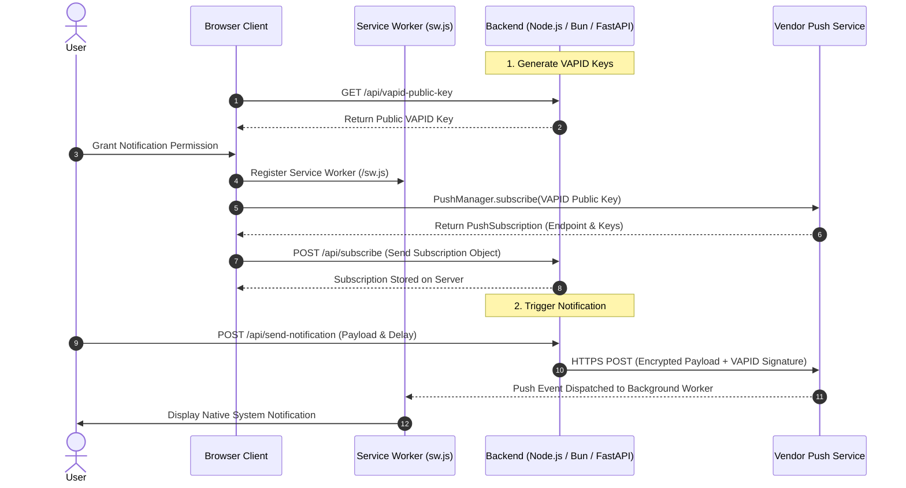

# Web Push Notification Demo (Monorepo: Node.js, Bun, Python FastAPI & Golang)

A lightweight, beginner-friendly demonstration of native **Web Push Notifications** using vanilla JavaScript, HTML, CSS, and backend implementations across **Node.js**, **Bun**, **Python (FastAPI)**, and **Golang**.

This project explores how web applications can deliver real-time push notifications **directly from your own backend server** using the standard W3C Web Push Protocol without relying on third-party push notification SDKs (like Firebase Cloud Messaging SDK or OneSignal) on the client.

---

## 📌 Key Objectives & Key Takeaways

- **No Third-Party Client SDKs**: Understand how Web Push operates natively using browser standards (`PushManager`, `ServiceWorker`) and standard VAPID key pairs.
- **Multi-Runtime & Polyglot Backend Support**: Compare identical Web Push architectures across **Node.js** (Express), **Bun** (Express), **Python** (FastAPI + Asyncio), and **Golang** (`net/http` + goroutines).
- **Monorepo Architecture**: Clean workspace dividing applications into `node-web-push`, `bun-web-push`, `fastapi-web-push`, and `golang-web-push`.
- **Interactive UI & Dashboard**: Clean 2-column layout to manage browser permissions, generate push subscriptions, and trigger instant or scheduled push notifications.

---

## 📚 Dedicated Implementation Guides

Looking to implement Web Push in your own project? Follow the complete, step-by-step integration guides tailored for each runtime:

- 🟢 **[Node.js Integration Guide](apps/node-web-push/README.md)**: Dependencies, VAPID key management, Express setup, service worker lifecycle, and production database persistence.
- ⚡ **[Bun (TypeScript) Integration Guide](apps/bun-web-push/README.md)**: Native TypeScript setup, zero-dependency `.env` loading, async push dispatch, automated testing with `bun:test`, and deployment recommendations.
- 🐍 **[Python (FastAPI) Integration Guide](apps/fastapi-web-push/README.md)**: Modern asynchronous FastAPI setup, Pydantic type validation, background scheduled tasks, pywebpush integration, and automated testing with `pytest`.
- 🐹 **[Golang Integration Guide](apps/golang-web-push/README.md)**: Idiomatic Go setup using standard `net/http` routing, `webpush-go` encryption, concurrent goroutine dispatching, and thread-safe subscription management.

---

## 🛠️ Architecture & How Web Push Works

Web Push Notifications rely on three core pillars:
1. **Client Browser & Service Worker**: Requests user permission and registers a background worker script (`sw.js`).
2. **Push Service Endpoint**: Browser vendor-provided endpoint (e.g., Mozilla Push Service, Google FCM Push endpoint) created when the user subscribes via `pushManager.subscribe()`.
3. **Application Backend (Node.js, Bun, or Python FastAPI)**: Encrypts payloads with **VAPID Keys** and sends HTTPS POST requests directly to the subscription endpoint using standard cryptographic libraries (`web-push` / `pywebpush`).

### Architecture Flow Diagram



---

## 📁 Monorepo Structure

```
WaraWara-Web/
├── pnpm-workspace.yaml            # Monorepo workspace configuration
├── package.json                   # Root orchestrator scripts, Biome & TypeScript configs
├── biome.json                     # Root linter and formatter configuration
├── scripts/
│   └── generate-vapid.js          # Cryptographic keypair generator ('pnpm generate-vapid')
├── apps/
│   ├── node-web-push/             # Node.js implementation
│   │   ├── public/                # Static assets (HTML, CSS, JS, Service Worker)
│   │   ├── src/
│   │   │   ├── config.js          # Env & VAPID key resolution (native process.loadEnvFile)
│   │   │   ├── types.js           # JSDoc type contracts
│   │   │   ├── services/
│   │   │   │   ├── subscription.service.js  # Client push subscription storage
│   │   │   │   └── push.service.js          # Web-push client & multicast dispatch
│   │   │   ├── routes/
│   │   │   │   └── push.routes.js           # Express Router endpoints
│   │   │   └── app.js             # Express app setup & middleware
│   │   ├── server.js              # Clean entrypoint listener (port 3000)
│   │   ├── tsconfig.json          # JSDoc typecheck configuration
│   │   └── package.json           # Node package config
│   │
│   ├── bun-web-push/              # Bun implementation
│   │   ├── public/                # Static assets (HTML, CSS, JS, Service Worker)
│   │   ├── src/
│   │   │   ├── config.ts          # Env & VAPID configuration
│   │   │   ├── types.ts           # TypeScript interfaces & DTOs
│   │   │   ├── services/
│   │   │   │   ├── subscription.service.ts  # Client push subscription storage
│   │   │   │   └── push.service.ts          # Web-push client & multicast dispatch
│   │   │   ├── routes/
│   │   │   │   └── push.routes.ts           # Typed Express Router endpoints
│   │   │   └── app.ts             # Express app factory
│   │   ├── server.ts              # Clean entrypoint listener (port 3001)
│   │   ├── tsconfig.json          # Bun TypeScript config
│   │   └── package.json           # Bun package config
│   │
│   └── fastapi-web-push/          # Python FastAPI implementation
│       ├── public/                # Static assets (HTML, CSS, JS, Service Worker)
│       ├── src/
│       │   ├── config.py          # Env & VAPID configuration
│       │   ├── models.py          # Pydantic schemas (PushSubscription, PushPayload)
│       │   ├── services/
│       │   │   ├── subscription_service.py  # In-memory subscription store
│       │   │   └── push_service.py          # pywebpush client & push dispatch
│       │   ├── routes/
│       │   │   └── push_routes.py           # FastAPI endpoints
│       │   └── main.py            # FastAPI entrypoint & static mount
│       ├── tests/
│       │   └── test_push_routes.py          # Pytest endpoint test suite
│       └── pyproject.toml         # PEP 621 package config, Ruff & Mypy settings
│
└── apps/
    └── golang-web-push/           # Golang implementation
        ├── public/                # Static assets (HTML, CSS, JS, Service Worker)
        ├── config/
        │   └── config.go          # Env & VAPID configuration
        ├── models/
        │   └── models.go          # Strongly typed push payloads & structs
        ├── services/
        │   ├── subscription_service.go # Thread-safe subscription registry
        │   └── push_service.go         # webpush-go client & concurrent dispatch
        ├── handlers/
        │   └── handlers.go        # HTTP API endpoints
        ├── tests/
        │   ├── handlers_test.go   # Integration tests
        │   └── subscription_test.go # Unit tests
        ├── Makefile               # Task automation (run, test, vet, fmt, check)
        ├── go.mod                 # Go module definition (go 1.26.4)
        ├── go.sum                 # Dependency checksums
        └── main.go                # HTTP listener & static file server (port 8080)
```

---

## 🚀 Getting Started

### Pinned Experimental Runtime Specifications

| Runtime / Tool | Pinned Version | Version File | Config / Engine Constraint |
| :--- | :--- | :--- | :--- |
| **Node.js** | `v24.15.0` | `.nvmrc`, `.node-version`, `.tool-versions` | `"node": ">=24.0.0 <25.0.0"` |
| **Bun** | `v1.4.2` | `.bun-version`, `.tool-versions` | `"bun": ">=1.4.0 <2.0.0"` |
| **pnpm** | `v10.25.0` | `package.json` (`packageManager`), `.tool-versions` | `"pnpm": ">=10.0.0"` |
| **Python** | `v3.13.5` | `.python-version`, `.tool-versions` | `requires-python = ">=3.10"` |
| **Golang** | `v1.26.4` | `.go-version`, `.tool-versions` | `go.mod (>= 1.22)` |

### Prerequisites

- [Node.js](https://nodejs.org/) (`v24.15.0` recommended, or `^24.x`)
- [Bun](https://bun.sh/) (`v1.4.2` recommended, or `^1.4.x`)
- [pnpm](https://pnpm.io/) (`v10.25.0`)
- [Python](https://www.python.org/) (`v3.13.5` recommended, or `>=3.10`)
- [Golang](https://go.dev/) (`v1.26.4` recommended, or `>=1.22`)

### Installation & Setup

1. **Install dependencies**:
   ```bash
   pnpm install
   ```

2. **Generate your own secure VAPID Keypair**:
   ```bash
   pnpm generate-vapid
   ```
   > [!IMPORTANT]
   > This command creates a `.env` file containing freshly generated cryptographic keys:
   > - `VAPID_PUBLIC_KEY`: Safe to expose to browsers to authenticate subscriptions.
   > - `VAPID_PRIVATE_KEY`: Kept confidential on the server to sign push requests. Never commit `.env` to git!
   > - `VAPID_SUBJECT`: Contact URI (e.g. `mailto:admin@example.com`) required by vendor push relays.

---

## 🏃 Running the Servers

You can run either backend or both simultaneously on different ports:

### Option 1: Run Node.js Server (Port 3000)
```bash
pnpm start:node
```
Open your browser at: `http://localhost:3000`

### Option 2: Run Bun Server (Port 3001)
```bash
pnpm start:bun
```
Open your browser at: `http://localhost:3001`

*(For Bun development with auto-reload: `pnpm dev:bun`)*

### Option 3: Run Python FastAPI Server (Port 8000)
```bash
cd apps/fastapi-web-push

# Setup virtual environment (if not yet created):
python -m venv .venv
# Activate venv:
.venv\Scripts\activate   # On Windows PowerShell: .venv\Scripts\Activate.ps1
# Install editable package:
pip install -e ".[dev]"

# Run FastAPI with auto-reload:
uvicorn src.main:app --reload --port 8000
```
Open your browser at: `http://localhost:8000`

### Option 4: Run Golang Server (Port 8080)
```bash
cd apps/golang-web-push

# Run with standard Go:
go run main.go

# Or using Make:
make run
```
Open your browser at: `http://localhost:8080`

---

## ⚡ How to Test the Demo

1. **Request Permission**: Click **Request Permission** and select **Allow** in your browser's prompt.
2. **Subscribe**: Click **Subscribe to Web Push**. This retrieves the VAPID public key from the backend and registers a `PushSubscription`.
3. **Dispatch Notification**:
   - Enter a custom title and message body.
   - Click **Send Push Notification**.
4. **Test Scheduled Push**: Set a delay (e.g., `5` seconds), click send, and minimize/switch browser tabs to observe the background Service Worker receiving the push notification even when the tab isn't active!

---

## 🧹 Code Quality & Developer Tooling

### JavaScript & TypeScript Workspaces (Node.js & Bun)
This monorepo utilizes **[Biome](https://biomejs.dev/)** for ultra-fast linting and formatting, along with **TypeScript (`tsc`)** for static type checking across both Node.js and Bun packages:

| Command | Purpose |
| :--- | :--- |
| `pnpm lint` | Run Biome linter across the entire monorepo |
| `pnpm lint:fix` | Automatically apply safe and suggested lint fixes |
| `pnpm format` | Format all JS/TS/JSON/CSS files with Biome |
| `pnpm format:check` | Verify formatting consistency without modifying files |
| `pnpm typecheck` | Run parallel TypeScript type checking (`tsc --noEmit`) on all packages |
| `pnpm test` | Run automated test suites across all workspaces in parallel |
| `pnpm test:node` | Run Node.js native test suite (`node --test`) |
| `pnpm test:bun` | Run Bun native test suite (`bun test`) |
| `pnpm check` | Run all checks (linting, formatting, typecheck, and tests) in a single pass |

### Python Workspace (`apps/fastapi-web-push`)
The Python implementation leverages **[Ruff](https://astral.sh/ruff)** for blazing-fast linting/formatting and **[Mypy](https://mypy.readthedocs.io/)** for static type checking, configured directly in `pyproject.toml`:

| Command (in `apps/fastapi-web-push`) | Purpose |
| :--- | :--- |
| `ruff check src tests` | Verify code quality, PEP conventions, and unused imports |
| `ruff check --fix src tests` | Auto-apply recommended lint fixes and organize imports |
| `ruff format --check src tests` | Verify formatting consistency against 100-character line length |
| `ruff format src tests` | Format all Python source files |
| `mypy src tests` | Run strict static type checking across routes and schemas |
| `pytest -v` | Run automated FastAPI endpoint test suite |

### Golang Workspace (`apps/golang-web-push`)
The Golang implementation utilizes standard Go toolchain commands and task automation via `Makefile`:

| Command (in `apps/golang-web-push`) | Purpose |
| :--- | :--- |
| `go test -v ./...` (or `make test`) | Run full automated unit and integration test suite |
| `go vet ./...` (or `make vet`) | Run static analysis to detect concurrency bugs and subtle flaws |
| `go fmt ./...` (or `make fmt`) | Automatically format all Go source files according to Go conventions |
| `make check` | Run formatting, static analysis, and tests in one pass |

---

## Conclusion

This setup demonstrates that Web Push Notifications follow identical W3C Push protocol standards regardless of your backend runtime or programming language. Whether running on **Node.js** (Express), **Bun** (Express), **Python** (FastAPI + Asyncio), or **Golang** (`net/http` + goroutines), the native browser Service Worker interacts with the exact same VAPID key exchange, subscription model, and encrypted push payload contract.
