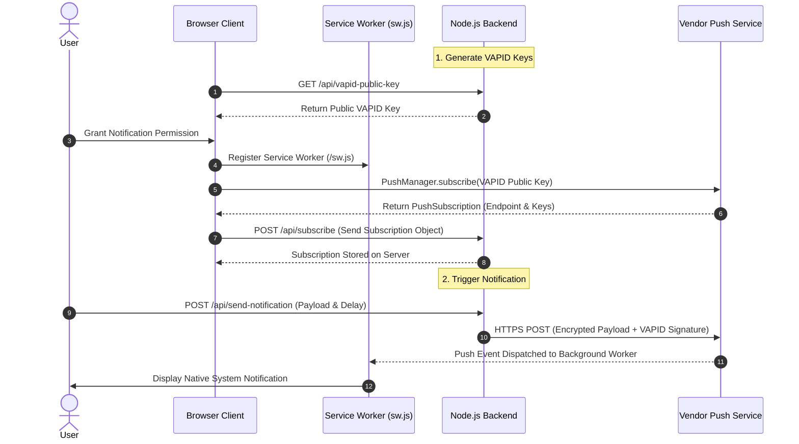

# Web Push Notification Demo

A lightweight, beginner-friendly demonstration of native **Web Push Notifications** using vanilla JavaScript, HTML, CSS, and a Node.js Express backend. 

This project explores how web applications can deliver real-time push notifications **directly from your own backend server** using the standard W3C Web Push Protocol without relying on third-party push notification services like Firebase Cloud Messaging (FCM) or Apple Push Notification service (APNs).

---

## 📌 Key Objectives & Key Takeaways

- **No Third-Party Services Needed**: Understand how Web Push operates natively using browser standards (`PushManager`, `ServiceWorker`) and standard VAPID key pairs.
- **Self-Hosted Infrastructure**: Control push notifications fully on your Node.js backend.
- **Interactive UI & Dashboard**: Clean 2-column layout to manage browser permissions, generate push subscriptions, and trigger instant or scheduled push notifications.

---

## 🛠️ Architecture & How Web Push Works

Web Push Notifications rely on three core pillars:
1. **Client Browser & Service Worker**: Requests user permission and registers a background worker script (`sw.js`).
2. **Push Service Endpoint**: Browser vendor-provided endpoint (e.g., Mozilla Push Service, Google FCM Push endpoint) created when the user subscribes via `pushManager.subscribe()`.
3. **Application Backend (Node.js)**: Encrypts payloads with **VAPID Keys** and sends HTTPS POST requests directly to the subscription endpoint.

### Architecture Flow Diagram



---

## 📁 Project Structure

```
WaraWara-Web/
├── public/
│   ├── index.html   # Main UI dashboard
│   ├── style.css    # Theme styles
│   ├── app.js       # Client-side logic & PushManager integration
│   └── sw.js        # Service worker handling push & notificationclick events
├── server.js        # Node.js Express server using 'web-push' library (JSDoc annotated)
├── package.json     # Node.js dependencies & scripts
└── README.md        # Documentation
```

---

## 🚀 Getting Started

Follow these steps to run the demo application locally on your machine.

### Prerequisites

- [Node.js](https://nodejs.org/) (v16 or higher)
- [pnpm](https://pnpm.io/) package manager

### Installation & Setup

1. **Clone or navigate to project directory**:
   ```bash
   git clone https://github.com/FarrelAD/WaraWara-Web.git
   cd WaraWara-Web
   ```

2. **Install dependencies using pnpm**:
   ```bash
   pnpm install
   ```

3. **Start the Express backend server**:
   ```bash
   pnpm start
   ```

4. **Access the application**:
   Open your browser and navigate to `http://localhost:3000`.

---

## ⚡ How to Test the Demo

1. **Request Permission**: Click the **Request Permission** button and click **Allow** in your browser's native prompt.
2. **Subscribe**: Click **Subscribe to Web Push**. This retrieves the VAPID public key from the server and registers a `PushSubscription` with the backend.
3. **Dispatch Notification**:
   - Enter a custom title and message body.
   - Click **Send Push via Node.js Server**.
4. **Test Scheduled Push**: Set a delay (e.g., `5` seconds), click send, and close or switch browser tabs to observe the background Service Worker handling the incoming push!

---

## 💡 Conclusion

This demo proves that **third-party push services (FCM/APNs) are not strictly mandatory for standard Web Applications**. By utilizing:
- Native **Service Worker API**
- **W3C Push API** (`PushManager`)
- Standard **VAPID Authentication** via `web-push` in Node.js

You can build, maintain, and fully own a self-hosted Push Notification system for web platforms!
