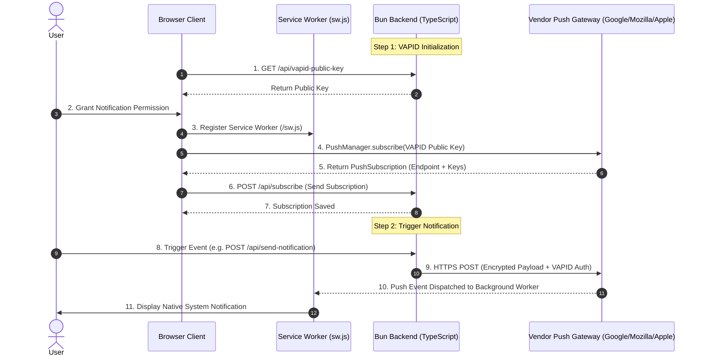
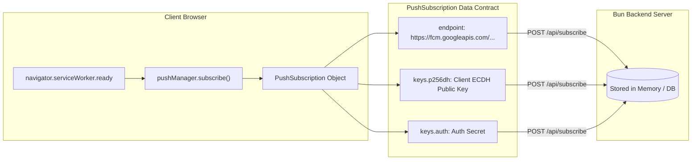
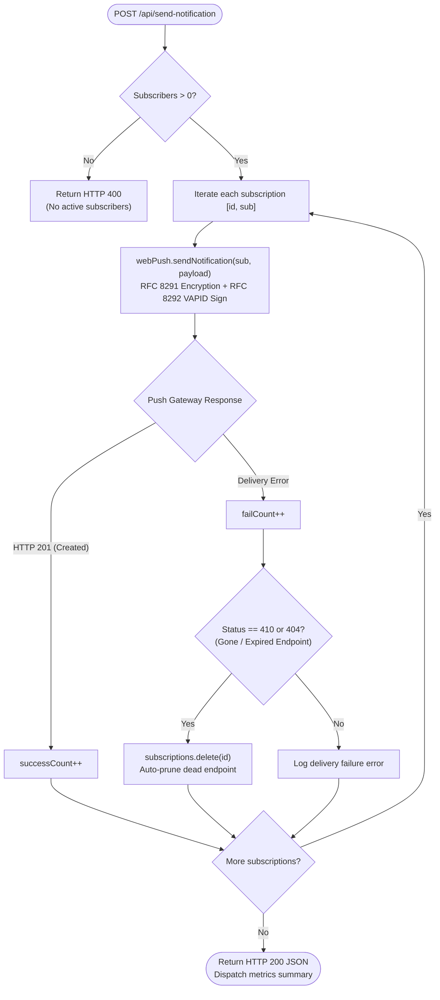

# Web Push Notification Integration Guide for Bun (TypeScript)

This guide provides a comprehensive, beginner-friendly walkthrough for implementing native, high-performance **Web Push Notifications** in your **Bun** runtime applications using TypeScript, Express, and standard W3C Web Push protocols.

---

## 📌 Architecture & Backend Responsibilities

Before writing any code, it is important to understand what the backend actually does in the Web Push ecosystem.

Native Web Push operates according to W3C standards using three components:
1. **Client Browser**: Registers a Service Worker (`sw.js`) and calls `registration.pushManager.subscribe()`.
2. **Vendor Push Gateway**: Managed by the browser vendor (Mozilla Push Service, Google FCM Push Gateway, Apple APNs) providing an HTTPS relay endpoint.
3. **Your Backend Server (Bun)**: Encrypts payloads and signs requests sent directly to the vendor push endpoint.



### The 4 Core Responsibilities of the Backend
1. **Distribute the Public VAPID Key**: The browser needs the server's public key (`applicationServerKey`) to encrypt subscriptions.
2. **Store Subscription Objects**: The browser sends a `PushSubscription` object consisting of:
   - `endpoint`: The vendor push gateway URL (e.g. `https://fcm.googleapis.com/...`).
   - `keys.p256dh`: Client ECDH public key (used by server to encrypt the payload).
   - `keys.auth`: Authentication secret (prevents replay attacks).
3. **Payload Encryption & Cryptographic Signing (VAPID)**: Payloads cannot be sent in plain text. The backend must encrypt the data using RFC 8291 and sign it using RFC 8292. The `web-push` library handles this automatically.
4. **Prune Stale Endpoints**: When users uninstall a browser or revoke permissions, the vendor push gateway invalidates the endpoint. Calling `sendNotification()` on a dead endpoint returns **HTTP 410 (Gone)** or **HTTP 404 (Not Found)**. The backend must catch these and delete them.



---

## 🚀 Step 1: Install Dependencies with Bun

In your project directory, install `express`, `cors`, `web-push`, and their TypeScript definitions:

```bash
bun add express cors web-push
bun add -d @types/express @types/cors @types/web-push bun-types
```

---

## 🔑 Step 2: Generate VAPID Keypair & Configure Environment

Generate a fresh keypair using Bun:

```bash
bun -e "import wp from 'web-push'; console.log(wp.generateVAPIDKeys());"
```

Save the output to your `.env` file at project root:

```ini
PORT=3001
VAPID_PUBLIC_KEY=your_generated_public_key
VAPID_PRIVATE_KEY=your_generated_private_key
VAPID_SUBJECT=mailto:admin@yourdomain.com
```

> [!CAUTION]
> **Keep `VAPID_PRIVATE_KEY` strictly secret!** Never commit `.env` into git. Bun will automatically load this file into `process.env` when you start your server.

---

## 💻 Step 3: TypeScript Backend Implementation

Let's break down the Bun TypeScript backend server step-by-step.

### 3.1: Server Setup & Imports
Import dependencies and configure middleware:

```typescript
import cors from 'cors';
import express, { type Request, type Response } from 'express';
import webPush, { type PushSubscription } from 'web-push';

const app = express();
const PORT = process.env.PORT || 3001;

// Enable CORS and JSON body parser
app.use(cors());
app.use(express.json());
```

### 3.2: Configure VAPID Details
Configure `web-push` using your environment variables:

```typescript
webPush.setVapidDetails(
  process.env.VAPID_SUBJECT || 'mailto:admin@example.com',
  process.env.VAPID_PUBLIC_KEY!,
  process.env.VAPID_PRIVATE_KEY!
);
```

### 3.3: Strongly Typed Subscriber Storage
Store active subscriptions in a Map keyed by subscription ID:

```typescript
// Store subscriptions in memory (replace with SQLite or Postgres in production)
const subscriptions = new Map<string, PushSubscription>();
```

### 3.4: Endpoint 1 - Public Key Distribution (`GET /api/vapid-public-key`)
Provides the public key to browser clients:

```typescript
app.get('/api/vapid-public-key', (_req: Request, res: Response) => {
  res.json({ publicKey: process.env.VAPID_PUBLIC_KEY });
});
```

### 3.5: Endpoint 2 - Register Client Subscription (`POST /api/subscribe`)
Validates and saves the incoming browser push subscription:

```typescript
app.post('/api/subscribe', (req: Request, res: Response) => {
  const subscription: PushSubscription = req.body;

  if (!subscription || !subscription.endpoint) {
    res.status(400).json({ error: 'Invalid subscription object' });
    return;
  }

  const id = Date.now().toString();
  subscriptions.set(id, subscription);

  console.log(`[Bun Server] Subscriber added. Total: ${subscriptions.size}`);
  res.status(201).json({
    message: 'Subscription registered on Bun server',
    id,
    totalSubscriptions: subscriptions.size,
  });
});
```

### 3.6: Endpoint 3 - Dispatch Notification (`POST /api/send-notification`)
Multicast notification dispatch with automatic cleanup of expired subscriptions:



```typescript
app.post('/api/send-notification', async (req: Request, res: Response): Promise<void> => {
  const { title, body, icon, url } = req.body;

  if (subscriptions.size === 0) {
    res.status(400).json({ error: 'No active push subscriptions found on Bun server!' });
    return;
  }

  const payload = JSON.stringify({
    title: title || 'Alert from Bun Server',
    body: body || 'High performance notification via Bun!',
    icon: icon || '/icon.png',
    data: { url: url || '/' },
  });

  let successCount = 0;
  let failCount = 0;

  for (const [id, sub] of subscriptions.entries()) {
    try {
      await webPush.sendNotification(sub, payload);
      successCount++;
    } catch (err: unknown) {
      const error = err as { message?: string; statusCode?: number };
      console.error(`[Bun Server] Delivery failed for ${id}:`, error?.message || err);
      failCount++;

      // Prune stale or expired endpoints (HTTP 410 Gone / 404 Not Found)
      if (error?.statusCode === 410 || error?.statusCode === 404) {
        subscriptions.delete(id);
        console.log(`[Bun Server] Pruned stale subscription ${id}`);
      }
    }
  }

  res.json({
    message: 'Push notification dispatch complete!',
    results: { successCount, failCount, totalSubscribers: subscriptions.size },
  });
});

app.listen(PORT, () => {
  console.log(`🚀 Bun Web Push server running at http://localhost:${PORT}`);
  console.log(`⚡ Runtime: Bun v${Bun.version}`);
});
```

---

## 🌐 Step 4: Client Implementation (Browser JavaScript)

```javascript
// client.js
function urlBase64ToUint8Array(base64String) {
  const padding = '='.repeat((4 - (base64String.length % 4)) % 4);
  const base64 = (base64String + padding).replace(/\-/g, '+').replace(/_/g, '/');
  const rawData = window.atob(base64);
  const outputArray = new Uint8Array(rawData.length);
  for (let i = 0; i < rawData.length; ++i) {
    outputArray[i] = rawData.charCodeAt(i);
  }
  return outputArray;
}

async function subscribeToPush() {
  if (!('serviceWorker' in navigator) || !('PushManager' in window)) {
    throw new Error('Push notifications are not supported in this browser.');
  }

  const permission = await Notification.requestPermission();
  if (permission !== 'granted') return;

  const registration = await navigator.serviceWorker.register('/sw.js');
  await navigator.serviceWorker.ready;

  // Retrieve public key from Bun server
  const keyRes = await fetch('/api/vapid-public-key');
  const { publicKey } = await keyRes.json();

  // Subscribe browser to push service
  const subscription = await registration.pushManager.subscribe({
    userVisibleOnly: true,
    applicationServerKey: urlBase64ToUint8Array(publicKey),
  });

  // Post subscription object to Bun backend
  await fetch('/api/subscribe', {
    method: 'POST',
    headers: { 'Content-Type': 'application/json' },
    body: JSON.stringify(subscription),
  });
}
```

---

## ⚙️ Step 5: Service Worker (`public/sw.js`)

```javascript
// public/sw.js
self.addEventListener('push', (event) => {
  const data = event.data ? event.data.json() : { title: 'Notification', body: 'New alert!' };

  event.waitUntil(
    self.registration.showNotification(data.title, {
      body: data.body,
      icon: data.icon || '/icon.png',
      data: data.data || { url: '/' },
    })
  );
});

self.addEventListener('notificationclick', (event) => {
  event.notification.close();
  const url = event.notification.data?.url || '/';

  event.waitUntil(
    clients.matchAll({ type: 'window', includeUncontrolled: true }).then((windowClients) => {
      for (const client of windowClients) {
        if (client.url === url && 'focus' in client) return client.focus();
      }
      if (clients.openWindow) return clients.openWindow(url);
    })
  );
});
```

---

## 🧪 Step 6: Automated Testing with `bun test`

Bun provides a built-in test runner. You can test your endpoints without starting a real port listener using `supertest`:

```typescript
// server.test.ts
import { describe, expect, it } from 'bun:test';
import request from 'supertest';
import { app } from './app';

describe('Web Push Endpoints', () => {
  it('GET /api/vapid-public-key returns key', async () => {
    const res = await request(app).get('/api/vapid-public-key');
    expect(res.status).toBe(200);
    expect(res.body).toHaveProperty('publicKey');
  });
});
```

Run tests with:
```bash
bun test
```

---

## 🛡️ Production Recommendations on Bun

1. **Database Persistence**: Use Bun's native `bun:sqlite` or an external PostgreSQL pool to store `PushSubscription` JSON records permanently.
2. **Reverse Proxy & HTTPS**: Deploy Bun behind Caddy, Nginx, or Cloudflare with automatic TLS certificates (HTTPS is mandatory for Web Push).
3. **Graceful Stale Pruning**: Ensure you handle HTTP 410/404 responses from vendor push gateways to maintain healthy subscriber pools and high delivery rates.
