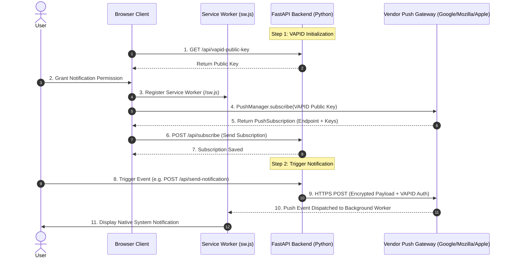

# Web Push Notification Integration Guide for Python (FastAPI)

This guide provides a comprehensive, beginner-friendly walkthrough for implementing native, high-performance **Web Push Notifications** in **Python** using **FastAPI**, **pywebpush**, and standard W3C Web Push protocols.

---

## 📌 Architecture & Backend Responsibilities

Before writing code, it is essential to understand the roles in the native Web Push ecosystem.

Native Web Push operates according to W3C standards using three components:
1. **Client Browser**: Registers a Service Worker (`sw.js`) and invokes `registration.pushManager.subscribe()`.
2. **Vendor Push Gateway**: Managed by the browser vendor (Mozilla Push Service, Google FCM Push Gateway, Apple APNs) providing an HTTPS relay endpoint.
3. **Your Backend Server (FastAPI)**: Signs requests with VAPID keys, encrypts payloads, and dispatches them asynchronously to the vendor push endpoint.



### The 4 Core Responsibilities of the Backend
1. **Distribute Public VAPID Key**: Client uses this key (`applicationServerKey`) to register with the Push Manager.
2. **Store PushSubscription Objects**: Contains the vendor endpoint, `keys.p256dh`, and `keys.auth`.
3. **Payload Encryption & Cryptographic Signing (VAPID)**: Encrypts data using RFC 8291 / RFC 8292 standards (`pywebpush`).
4. **Prune Stale Endpoints**: Automatically detect HTTP 404/410 status codes from vendor push relays and delete defunct subscriptions.

---

## 🚀 Setup & Installation

### 1. Prerequisites
- Python `v3.13.5` (Pinned via `.python-version` & `.tool-versions`, supports `>=3.10`)
- Pip or uv

### 2. Create Virtual Environment & Install Dependencies
```bash
python -m venv .venv
# On Windows PowerShell:
.venv\Scripts\Activate.ps1
# On Linux / macOS:
source .venv/bin/activate

# Install editable package with dev/test dependencies:
pip install -e ".[dev]"
```

`pyproject.toml` handles all packaging dependencies and metadata following the standard PEP 621 format.

---

## 🔑 Environment Configuration

Ensure your `.env` file (either at repository root or inside `apps/fastapi-web-push/`) contains your VAPID keys:

```ini
PORT=8000
VAPID_PUBLIC_KEY=BNcRdreALRFXTkOOUHK1EtK2wtaz5Ry4YfYCA_0QT9EgVKA7Gh272YjgqmtPa3WExtDH...
VAPID_PRIVATE_KEY=...
VAPID_SUBJECT=mailto:admin@example.com
```

---

## 📂 Project Structure

```
apps/fastapi-web-push/
├── public/                         # Client frontend assets & Service Worker
│   ├── index.html                  # Interactive control dashboard
│   ├── app.js                      # Service Worker registration & PushManager logic
│   ├── style.css                   # Responsive dashboard styling
│   └── sw.js                       # Background Service Worker push/notificationclick listener
├── src/
│   ├── config.py                   # Environment settings & VAPID validator
│   ├── models.py                   # Pydantic schemas (PushSubscription, PushPayload)
│   ├── services/
│   │   ├── subscription_service.py # In-memory subscription store
│   │   └── push_service.py         # pywebpush client & stale endpoint handling
│   ├── routes/
│   │   └── push_routes.py          # FastAPI endpoints (/api/vapid-public-key, /api/subscribe, ...)
│   └── main.py                     # FastAPI entrypoint & static mount
├── tests/
│   └── test_push_routes.py         # Pytest endpoint test suite
└── pyproject.toml                  # PEP 621 package metadata, dependencies & pytest config
```

---

## 🏃 Running the FastAPI Server

Start the application with Uvicorn:

```bash
uvicorn src.main:app --reload --port 8000
```

Open your browser at **`http://localhost:8000`** to access the interactive push dashboard!

---

## 🧪 Running Automated Tests

Run the test suite using pytest:

```bash
pytest -v
```

---

## 🧹 Code Quality & Developer Tooling

This package utilizes **Ruff** (for ultra-fast linting and formatting) and **Mypy** (for static type checking), configured directly in `pyproject.toml`:

| Task | Command | Purpose |
| :--- | :--- | :--- |
| **Lint Check** | `ruff check src tests` | Verify code style, imports, and anti-patterns |
| **Lint Fix** | `ruff check --fix src tests` | Automatically apply suggested fixes and organize imports |
| **Format Check** | `ruff format --check src tests` | Check file formatting against the 100-character line limit |
| **Format Code** | `ruff format src tests` | Automatically format all Python code files |
| **Type Check** | `mypy src tests` | Run static type analysis on routes, models, and services |
| **Run Tests** | `pytest -v` | Execute full automated unit/integration test suite |

