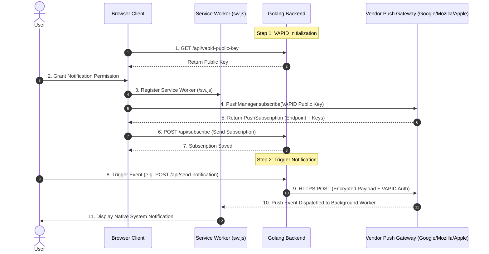

# Web Push Notification Integration Guide for Golang

A clean, production-ready implementation of native **Web Push Notifications** in **Golang** using the standard `net/http` package, [`github.com/SherClockHolmes/webpush-go`](https://github.com/SherClockHolmes/webpush-go), and standard W3C Web Push protocols.

---

## 📌 Architecture & Backend Responsibilities

Before writing code, it is essential to understand the roles in the native Web Push ecosystem.

Native Web Push operates according to W3C standards using three components:
1. **Client Browser**: Registers a Service Worker (`sw.js`) and invokes `registration.pushManager.subscribe()`.
2. **Vendor Push Gateway**: Managed by the browser vendor (Mozilla Push Service, Google FCM Push Gateway, Apple APNs) providing an HTTPS relay endpoint.
3. **Your Backend Server (Golang)**: Signs requests with VAPID keys, encrypts payloads, and dispatches them concurrently via lightweight goroutines to the vendor push endpoint.



### The 4 Core Responsibilities of the Backend
1. **Distribute Public VAPID Key**: Client uses this key (`applicationServerKey`) to register with the Push Manager.
2. **Store PushSubscription Objects**: Contains the vendor endpoint, `keys.p256dh`, and `keys.auth`.
3. **Payload Encryption & Cryptographic Signing (VAPID)**: Encrypts data using RFC 8291 / RFC 8292 standards (`webpush-go`).
4. **Prune Stale Endpoints**: Automatically detect HTTP 404/410 status codes from vendor push relays and delete defunct subscriptions from the store.

---

## 🏗️ Architecture & Directory Structure

```text
apps/golang-web-push/
├── public/                     # Client frontend assets & Service Worker
│   ├── index.html              # Interactive control dashboard
│   ├── app.js                  # Service Worker registration & PushManager logic
│   ├── style.css               # Responsive dashboard styling
│   └── sw.js                   # Background Service Worker push/notificationclick listener
├── config/
│   └── config.go               # Multi-path .env loading & VAPID key validator
├── models/
│   └── models.go               # Strongly typed push payloads & subscription structs
├── services/
│   ├── subscription_service.go # Thread-safe subscription memory registry (sync.RWMutex)
│   └── push_service.go         # Concurrent VAPID push dispatcher & pruning
├── handlers/
│   └── handlers.go             # HTTP handler endpoints for API
├── tests/
│   ├── handlers_test.go        # HTTP API integration tests (immediate & delayed)
│   └── subscription_test.go    # Subscription service unit tests
├── go.mod                      # Module definition & dependencies
├── go.sum                      # Cryptographic dependency checksums
├── Makefile                    # Standard developer task runner (run, test, vet, fmt, check)
├── main.go                     # Server bootstrap, CORS middleware, graceful shutdown
└── README.md
```

---

## 🚀 Setup & Running

### 1. Prerequisites
- **Go**: Version `1.26.4` (Pinned via `.go-version` & `.tool-versions`, supports `>=1.22`)
- **VAPID Keys**: Ensure `.env` exists in the repository root or local directory.

To generate new VAPID keys:
```bash
# From repository root:
pnpm generate-vapid
```

### 2. Environment Variables (`.env`)
```ini
PORT=8080
VAPID_PUBLIC_KEY=BNcRdreALRFXTkOOUHK1EtK2wtaz5Ry4YfYCA_0QT9EgVKA7Gh272YjgqmtPa3WExtDH...
VAPID_PRIVATE_KEY=...
VAPID_SUBJECT=mailto:admin@example.com
```

### 3. Run the Server
From the project directory:
```bash
cd apps/golang-web-push
go run main.go
```
Or using Make:
```bash
make run
```

The application will be live at **`http://localhost:8080`**.

---

## 🧪 Running Automated Tests

Run the native Go test suite from the project directory:
```bash
cd apps/golang-web-push
go test -v ./...
```
Or using Make:
```bash
make test
```

---

## 🧹 Code Quality & Developer Tooling

This package provides native Go developer tooling and task automation via `Makefile`:

| Task | Command | Purpose |
| :--- | :--- | :--- |
| **Run Server** | `make run` (or `go run main.go`) | Start the Web Push server on port 8080 |
| **Run Tests** | `make test` (or `go test -v ./...`) | Execute full unit and integration test suite |
| **Vet Code** | `make vet` (or `go vet ./...`) | Run Go static analysis to inspect for subtle defects |
| **Format Code** | `make fmt` (or `go fmt ./...`) | Format all Go source files according to Go standards |
| **Full Check** | `make check` | Run formatting, static analysis, and tests in one pass |

---

## 🔌 API Endpoints

### 1. `GET /api/vapid-public-key`
Returns the application server public key for `pushManager.subscribe()`.
- **Response**:
  ```json
  {
    "publicKey": "BI..."
  }
  ```

### 2. `POST /api/subscribe`
Stores client push subscription details.
- **Request Body**:
  ```json
  {
    "endpoint": "https://fcm.googleapis.com/fcm/send/...",
    "keys": {
      "p256dh": "...",
      "auth": "..."
    }
  }
  ```
- **Response (201 Created)**:
  ```json
  {
    "message": "Subscription stored successfully on Go server",
    "totalSubscriptions": 1
  }
  ```

### 3. `POST /api/send-notification`
Triggers immediate or delayed push notifications.
- **Request Body**:
  ```json
  {
    "title": "Hello from Go!",
    "body": "Web push sent concurrently via goroutines.",
    "delaySeconds": 0,
    "icon": "/icon.png",
    "tag": "custom-tag"
  }
  ```
- **Response (200 OK)**:
  ```json
  {
    "message": "Push notification process initiated on Go!",
    "subscribersTargeted": 1,
    "results": {
      "total": 1,
      "successful": 1,
      "failed": 0,
      "pruned": 0
    }
  }
  ```
