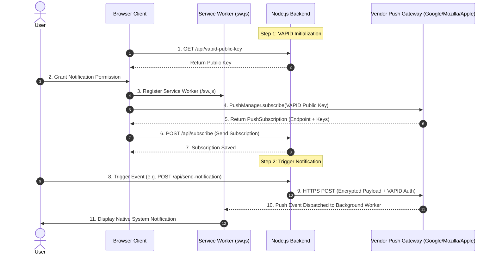
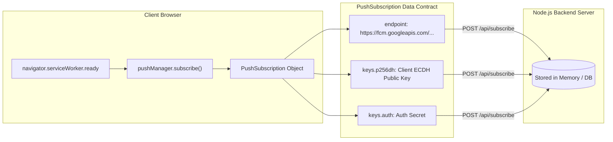
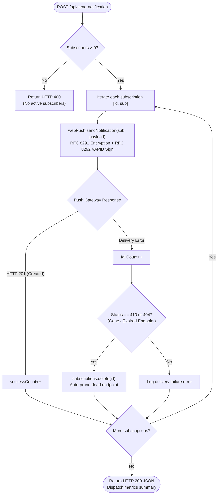

# Web Push Notification Integration Guide for Node.js

This guide provides a comprehensive, beginner-friendly walkthrough for implementing native **Web Push Notifications** in your own **Node.js** applications without requiring third-party push notification SDKs (like Firebase Cloud Messaging SDK or OneSignal) on the client.

---

## 📌 Architecture & Backend Responsibilities

Before writing any code, it is important to understand what the backend actually does in the Web Push ecosystem.

Native Web Push operates according to W3C standards using three components:
1. **Client Browser**: Registers a Service Worker (`sw.js`) and calls `registration.pushManager.subscribe()`.
2. **Vendor Push Service**: Managed automatically by the browser vendor (Mozilla Push Service, Google FCM Push Gateway, Apple APNs) providing an HTTPS relay endpoint.
3. **Your Backend Server (Node.js)**: Encrypts payloads and signs requests sent directly to the vendor push endpoint.



### The 4 Core Responsibilities of the Backend
1. **Distribute the Public VAPID Key**: The browser needs the server's public key (`applicationServerKey`) to encrypt subscriptions.
2. **Store Subscription Objects**: The browser sends a `PushSubscription` object consisting of:
   - `endpoint`: The vendor push gateway URL (e.g. `https://fcm.googleapis.com/...`).
   - `keys.p256dh`: Client ECDH public key (used by server to encrypt the payload).
   - `keys.auth`: Authentication secret (prevents replay attacks).
3. **Payload Encryption & Cryptographic Signing (VAPID)**: Payloads cannot be sent in plain text. The backend must encrypt the data using RFC 8291 and sign it using RFC 8292. The `web-push` library handles this automatically.
4. **Prune Stale Endpoints**: When users uninstall a browser or revoke permissions, the vendor push gateway invalidates the endpoint. Calling `sendNotification()` on a dead endpoint returns **HTTP 410 (Gone)** or **HTTP 404 (Not Found)**. The backend must catch these and delete them.



---

## 🚀 Step 1: Install Dependencies

In your project directory, install `express`, `cors`, and `web-push`:

```bash
npm install express cors web-push
# Or with pnpm:
pnpm add express cors web-push
```

---

## 🔑 Step 2: Generate VAPID Keypair & Configure Environment

VAPID (Voluntary Application Server Identification) keys authenticate your backend server to browser push services.

Generate a fresh keypair using the `web-push` CLI:

```bash
npx web-push generate-vapid-keys
```

Store the generated keys in your `.env` file:

```ini
PORT=3000
VAPID_PUBLIC_KEY=your_generated_public_key
VAPID_PRIVATE_KEY=your_generated_private_key
VAPID_SUBJECT=mailto:admin@yourdomain.com
```

> [!CAUTION]
> **Keep `VAPID_PRIVATE_KEY` strictly secret!** Never commit `.env` into git. Anyone with your private key can impersonate your server and send unauthorized push messages to your users.

---

## 💻 Step 3: Backend Implementation

Let's break down the backend server step-by-step so you understand every part.

### 3.1: Server Setup & Middleware
Initialize Express and configure middleware for handling CORS and JSON request bodies:

```javascript
const express = require('express');
const cors = require('cors');
const webPush = require('web-push');

const app = express();
const PORT = process.env.PORT || 3000;

// Enable CORS so your frontend can communicate with the backend
app.use(cors());

// Required: parse incoming JSON bodies for subscriptions and notifications
app.use(express.json());
```

### 3.2: Configure VAPID Details
Tell `web-push` which keys and contact information to use:

```javascript
// The subject must be a mailto: address or HTTPS URL so vendor services
// can reach the server administrator if abnormal push traffic is detected.
webPush.setVapidDetails(
  process.env.VAPID_SUBJECT || 'mailto:admin@example.com',
  process.env.VAPID_PUBLIC_KEY,
  process.env.VAPID_PRIVATE_KEY
);
```

### 3.3: Storage Registry for Push Subscriptions
We store subscriptions in memory for this demo. In production, replace this with a database (PostgreSQL, MongoDB, Redis, etc.):

```javascript
/**
 * Map storing active client push subscriptions keyed by unique ID.
 * @type {Map<string, webPush.PushSubscription>}
 */
const subscriptions = new Map();
```

### 3.4: Endpoint 1 - Public Key Distribution (`GET /api/vapid-public-key`)
The frontend client fetches this key before requesting a subscription from the browser:

```javascript
app.get('/api/vapid-public-key', (req, res) => {
  res.json({ publicKey: process.env.VAPID_PUBLIC_KEY });
});
```

### 3.5: Endpoint 2 - Register Client Subscription (`POST /api/subscribe`)
When the browser subscribes via `PushManager`, it posts the `PushSubscription` JSON here:

```javascript
app.post('/api/subscribe', (req, res) => {
  const subscription = req.body;

  // Basic validation: ensure an endpoint is provided
  if (!subscription || !subscription.endpoint) {
    return res.status(400).json({ error: 'Invalid subscription object' });
  }

  const id = Date.now().toString();
  subscriptions.set(id, subscription);

  console.log(`[Server] New subscriber added. Total subscribers: ${subscriptions.size}`);
  res.status(201).json({
    message: 'Subscription stored successfully on server',
    id,
    totalSubscriptions: subscriptions.size,
  });
});
```

### 3.6: Endpoint 3 - Dispatch Notification (`POST /api/send-notification`)
Encapsulates payload creation, encryption, multicast delivery, and automatic stale subscription pruning:



```javascript
app.post('/api/send-notification', async (req, res) => {
  const { title, body, icon, url } = req.body;

  if (subscriptions.size === 0) {
    return res.status(400).json({ error: 'No active push subscriptions found on server!' });
  }

  // Construct payload JSON string
  const payload = JSON.stringify({
    title: title || 'New Notification',
    body: body || 'You have received an update!',
    icon: icon || '/icon.png',
    data: { url: url || '/' },
  });

  let successCount = 0;
  let failCount = 0;

  // Multicast delivery to all registered subscriptions
  for (const [id, sub] of subscriptions.entries()) {
    try {
      // webPush encrypts the payload using the client's public keys (RFC 8291)
      // and signs the request using the server's private key (RFC 8292)
      await webPush.sendNotification(sub, payload);
      successCount++;
    } catch (err) {
      console.error(`[Server] Delivery failed for ${id}:`, err.message);
      failCount++;

      // Automatic Pruning: HTTP 410 (Gone) or 404 (Not Found) means the user
      // revoked permission or uninstalled the browser. We MUST remove it.
      if (err.statusCode === 410 || err.statusCode === 404) {
        subscriptions.delete(id);
        console.log(`[Server] Removed expired subscription ${id}`);
      }
    }
  }

  res.json({
    message: 'Push notification dispatch complete!',
    results: { successCount, failCount, totalSubscribers: subscriptions.size },
  });
});

app.listen(PORT, () => console.log(`Server running at http://localhost:${PORT}`));
```

---

## 🌐 Step 4: Client Implementation (Browser JavaScript)

This code runs in the browser (vanilla JS, React, Vue, Svelte, Next.js, or any frontend):

```javascript
// client.js

// 1. Helper function: Convert base64url VAPID key to Uint8Array
function urlBase64ToUint8Array(base64String) {
  const padding = '='.repeat((4 - (base64String.length % 4)) % 4);
  const base64 = (base64String + padding).replace(/\-/g, '+').replace(/_/g, '/');
  const rawData = window.atob(base64);
  const outputArray = new Uint8Array(rawData.length);
  for (let i = 0; i < rawData.length; ++i) {
    outputArray[i] = rawData.charCodeAt(i);
  }
  return outputArray;
}

// 2. Request permission and register PushSubscription
async function subscribeUserToPush() {
  if (!('serviceWorker' in navigator) || !('PushManager' in window)) {
    alert('Web Push is not supported in this browser.');
    return;
  }

  // Request browser permission
  const permission = await Notification.requestPermission();
  if (permission !== 'granted') {
    alert('Permission for notifications was denied.');
    return;
  }

  // Register service worker
  const registration = await navigator.serviceWorker.register('/sw.js');
  await navigator.serviceWorker.ready;

  // Retrieve public VAPID key from backend
  const keyResponse = await fetch('/api/vapid-public-key');
  const { publicKey } = await keyResponse.json();

  // Subscribe via browser PushManager
  const subscription = await registration.pushManager.subscribe({
    userVisibleOnly: true,
    applicationServerKey: urlBase64ToUint8Array(publicKey),
  });

  // Save subscription to backend server
  await fetch('/api/subscribe', {
    method: 'POST',
    headers: { 'Content-Type': 'application/json' },
    body: JSON.stringify(subscription),
  });

  alert('Subscribed successfully to Web Push notifications!');
}
```

---

## ⚙️ Step 5: Service Worker Implementation (`sw.js`)

Save this file in your static root directory (e.g., `public/sw.js`):

```javascript
// sw.js - Background Service Worker

self.addEventListener('install', (event) => {
  self.skipWaiting();
});

self.addEventListener('activate', (event) => {
  event.waitUntil(self.clients.claim());
});

// 1. Handle incoming background push message from server
self.addEventListener('push', (event) => {
  let data = { title: 'New Alert', body: 'You received a notification!' };

  if (event.data) {
    try {
      data = event.data.json();
    } catch {
      data.body = event.data.text();
    }
  }

  const options = {
    body: data.body,
    icon: data.icon || '/icon.png',
    badge: data.badge || '/badge.png',
    data: data.data || { url: '/' },
    vibrate: [200, 100, 200],
  };

  event.waitUntil(self.registration.showNotification(data.title, options));
});

// 2. Handle user clicking on notification
self.addEventListener('notificationclick', (event) => {
  event.notification.close();
  const targetUrl = event.notification.data?.url || '/';

  event.waitUntil(
    clients.matchAll({ type: 'window', includeUncontrolled: true }).then((windowClients) => {
      // If a window is already open with the target URL, focus it
      for (const client of windowClients) {
        if (client.url === targetUrl && 'focus' in client) {
          return client.focus();
        }
      }
      // Otherwise, open a new browser window/tab
      if (clients.openWindow) {
        return clients.openWindow(targetUrl);
      }
    })
  );
});
```

---

## 🛡️ Production Checklist

1. **HTTPS Is Mandatory**: Service Workers and `PushManager.subscribe()` only work over **HTTPS** in production (browsers permit `http://localhost` only during development).
2. **Persistent Database**: Replace in-memory `Map` with PostgreSQL, MySQL, MongoDB, or Redis to persist `PushSubscription` records across server restarts.
3. **Stale Endpoint Pruning**: Always catch errors during `webPush.sendNotification`. When an endpoint returns HTTP `404` or `410 Gone`, delete that subscription from your database.
4. **VAPID Subject**: Always set `VAPID_SUBJECT` to a valid email (`mailto:ops@yourdomain.com`) or support URL so push services can contact you regarding rate limits.
